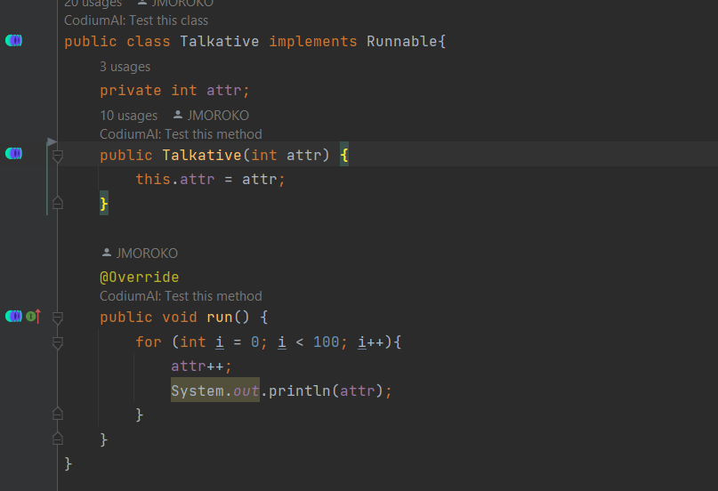
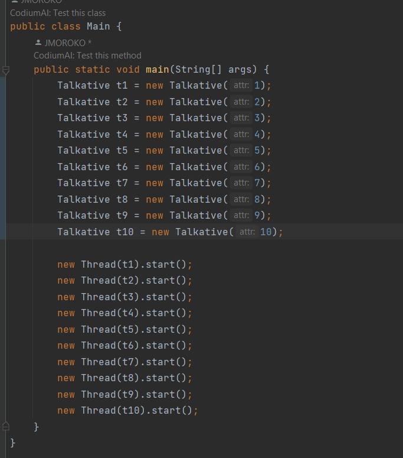
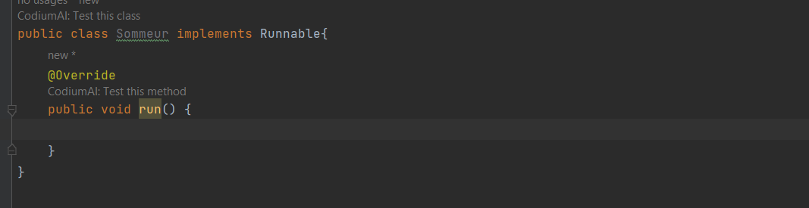

<h1>Mise en place d'un multi-threads</h1>
<h2>Exercice 1</h2>
1- Creation de la class, de ses attributs et du constructeur   
2- Implémentation de Runnable par la class  
3- Redéfinition de la méthode run   

4- Création de 10 instances de la class thread  
5- Appeler la méthode start sur chacun des objets de type thread

6- Nous constatons une exécution paralèlle des threads qui se terminent les uns après les autres.
<h2>Exercice 2</h2>
1- Création de la class Sommeur qui implement l'interface Runnable  

2- 